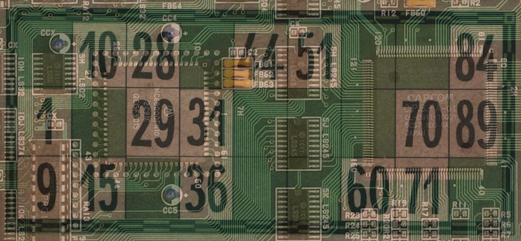

# OpenBanko: Scaling for the Elder Generation

Tools and toys for Big Banko processing

## Bankopladeformat

The specification for banko cards: [bankopladeformat.md](bankopladeformat.md)

## Utilities

+ [bankoconv](bankoconv): Convert between banko formats
+ [bankopak](bankopak): Compress and decompress banko boards
+ [bankopladeformat](bankopladeformat): Perform miscellaneous
  operations on banko cards in the bankopladeformat format
+ [bankoviser](bankoviser): Interact with banko boards in the terminal
+ [barc](barc): Check if boards are valid banko boards -- also
  generalizes to other games through a DSL
+ [cbankosim](cbankosim/): Automatically simulate playing banko
+ [futbankosim](futbankosim/): GPU-accelerated massively parallel banko simulation

## Citation

If you use any of this code for research, please cite it as:

    @Misc{bigbanko,
      author =   {Henriksen, Troels; Fuck, Brain; Serup, Niels Gustav Westphal},
      title =    {Big Banko},
      institution = {EggsML}
      year = {2015--2018}
    }

## In case of addiction

The OpenBanko project recognises that gambling can be a significant
harmful influence.  If you find that your quality of life is
negatively impacted by banko, please seek help immediately.  Danes can
inquire at [Ludomanilinjen](http://www.ludomanilinjen.dk/).
